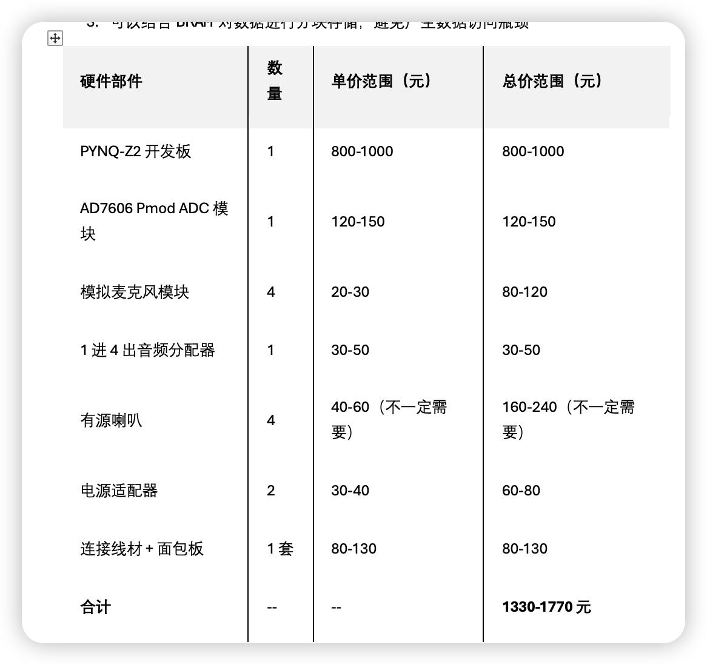

# ICA-on-PYNQ-Z2
ICA算法介绍：
独立成分分析（Independent Component Analysis，简称ICA）是一种重要的盲源分离（Blind Source Separation, BSS） 技术，核心目标是从一组混合信号中分离出统计上相互独立的源信号—— 且分离过程中无需知道源信号的具体分布和混合方式（仅需满足一定假设）。它在信号处理、机器学习、生物医学等领域有广泛应用，最经典的例子就是 “鸡尾酒会问题”。
这个项目主要是使用PYNQ-Z2的ARM+FPGA结构进行ICA算法的加速，达到一个实时分离的效果
# 基础功能
1.	通过双麦克风收集信号
2.	通过FPGA算法加速ICA实现声源分离
# 基本流程
1.  ARM控制信号采集：通过PYNQ-Z2的ARM Cortex-A9处理器控制麦克风，以指定采样率（如16kHz）和位宽（如16bit）采集双声道混合声信号。  
2.  DMA传输至FPGA：采集的原始信号通过DMA直接传输至FPGA，避免CPU参与数据搬运，提升效率。  
3.  FPGA端处理：在FPGA内先完成FIR低通滤波等噪音预处理，再通过硬件加速实现ICA算法的核心环节（白化、FastICA迭代优化），分离出独立声源。  可以通过HLS实现
4.  DMA回传与ARM输出：分离后的独立声源信号通过DMA回传至ARM，再由ARM驱动音频接口（配合音频分配器）将不同声源分别输出至喇叭（亦或者是别的输出）。
# 可能需要的部件

